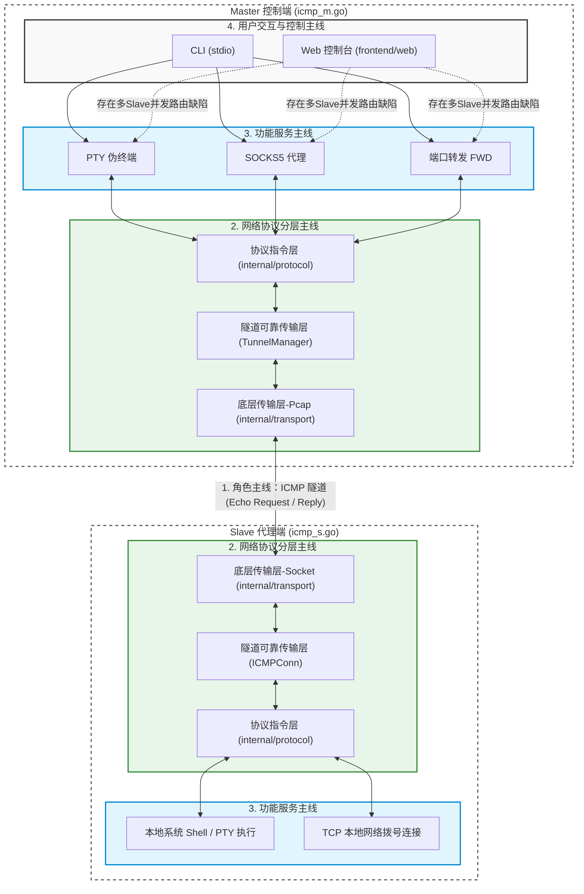

# ICMP Tunnel 项目架构图

本文档描述了 ICMP Tunnel 项目的整体架构和网络分层设计。

## 架构拓扑

整个项目以 ICMP 通信为分界线，分为 **Master (控制端)** 与 **Slave (代理端)** 两个物理节点。在这两个节点内部，严格遵循了从下到上三层递进的架构逻辑。

## 图解说明

从这张图中，你可以清晰地对应到我们之前梳理的 4 条主线：

1. **左边 Master vs 右边 Slave**，通过底层的 `ICMP 隧道` 虚线相连，这是**角色主线**。
2. 每个大黑框内部，从下到上严格经历了绿色的 **网络协议分层主线**（底层收发 -> 隧道化 -> 协议解包）。
3. 解析出协议后，向上流动到蓝色的 **功能服务主线**（决定这个包是用来做终端命令控制，还是 TCP 代理）。
4. 在最顶部（仅 Master 端拥有）灰色的区域，是 **用户交互主线**。图中标红虚线的部分，指出了 Web UI / 代理向下调用时存在的“多 Slave 并发路由缺陷”：因为 `TunnelManager` 内部共用单个全局 `outbound` 发送队列，在有多个 Slave 同时与 Master 交互时，任何活跃 Slave 发送的 ICMP Echo Request 都可能取走队列中的包并返回，导致数据流在多 Slave 并存时可能被错误路由给非目标 Slave。这是目前系统的一大局限。

## 分层说明

### 1. 传输层 (Transport)
- **Master**: 使用 `pcap` 绕过内核限制，直接抓取网络包并伪造 ICMP Echo Reply 进行下发指令。
- **Slave**: 使用原生的 Raw Socket 主动发送 ICMP Echo Request (Ping) 并接收 Reply。

### 2. 隧道层 (Tunnel)
由于 ICMP 本身是无状态且不可靠的协议，本层 (`TunnelManager` / `ICMPConn`) 负责将其封装为可靠数据流。
- 引入了可靠连接握手、接收端乱序重组、ACK 确认机制和超时重传 (ARQ)。
- 支持多连接会话 (Session) 的多路复用。
- **局限**：目前的重传延迟为固定的 100ms，发送端滑动窗口静态硬编码限制为 64，尚未实现动态 RTT/RTO 指数退避和 TCP 级的拥塞控制算法。

### 3. 协议层 (Protocol)
在此层定义了项目的自定义指令包，剥离或添加魔术字头部：
- `CmdShell`: 终端交互指令。
- `CmdTCPDial`: 触发网络拨号代理的指令。

### 4. 服务与交互层 (Service & UI)
向上提供核心业务功能：
- **PTY**: 全双工的高级伪终端交互。
- **SOCKS / FWD**: SOCKS5 代理及端口映射。
- **控制途径**: 纯命令行 (CLI) 和基于 WebSocket 的可视化 Web UI 控制台。
