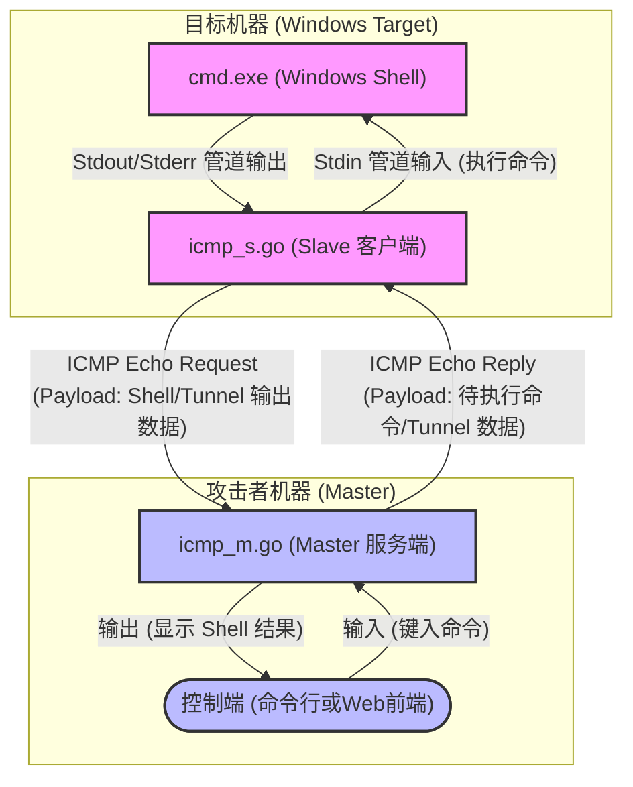
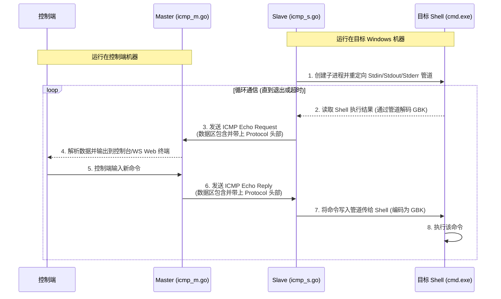

# icmp 数据流程图

整个项目以 ICMP 协议为基础建立数据传输。它的数据流主要在目标机器（运行 Slave 服务）和控制者机器（运行 Master 服务）之间通过 ICMP Echo 请求和回复进行传输，从而绕过常见的 TCP/UDP 端口过滤。

下面是系统的数据流程和交互时序图。

## 数据流向图 (Data Flow Diagram)

这个图展示了各个组件之间是如何连接和传递数据的：

## 交互时序图 (Sequence Diagram)

这个图展示了在运行期间，数据随时间流动的具体过程：

## 核心数据流说明
1. **进程创建与 I/O 重定向**：目标机器上的 Slave 程序启动时，会通过 Go 标准库 `exec.Command("cmd.exe")` 衍生一个隐式的 `cmd.exe` 进程，并通过 `StdinPipe`/`StdoutPipe` 接管其标准输入（Stdin）和标准输出（Stdout/Stderr）。
2. **上行数据（Target -> Attacker）**：Slave 程序通过协程循环读取 `cmd.exe` 产生的结果，在将其编码转换（GBK 转 UTF-8）后放入发送队列。然后，将这些结果数据加上协议头，作为 **ICMP Echo Request (Ping 请求)** 的 Payload 发送给 Master 的 IP 地址。
3. **下行数据（Attacker -> Target）**：Master 程序截获来自目标机器的 ICMP Echo Request 请求包，提取其中数据输出到控制台或转发给前端 WebSocket 连接。随后读取控制端输入的命令，在进行协议头格式化后封装在对应的 **ICMP Echo Reply (Ping 回复)** 的 Payload 中返回给 Slave。
4. **命令执行**：Slave 接收到回复包后，提取出 Payload 中的命令字符串并转换编码为 GBK，通过 `StdinPipe` 写入到 `cmd.exe` 进程中，从而完成命令执行。
