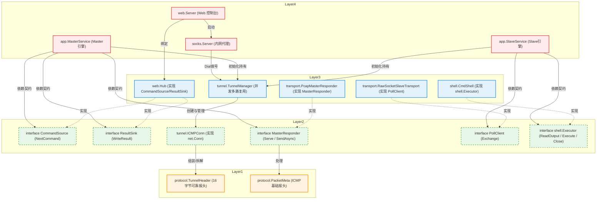

# 结构体依赖架构图 (Dependency-Based Architecture)

基于**依赖倒置原则（Dependency Inversion）**和实际代码中的 `import` 及调用关系，我重新将所有核心 Struct 和 Interface 划分为真正的 4 层依赖架构。

---

## 1. 严格依赖分层拓扑图

在下图中：
* **同一层级的方块之间绝对没有互相调用（完全独立）**。
* **箭头永远只指向下一层（单向依赖）**。



---

## 2. 依赖分层原理解析

### Base Layer（底层协议数据）：`protocol`
这里的 `Struct` 是最纯粹的，内部只有基本类型，**不 import 任何其他包**。谁都可以调用它们。

### Contract Layer（契约与基础组件）：接口 & `ICMPConn`
接口本身没有依赖，它们是被依赖的对象，用于阻断 L4 直接依赖 L3 的重耦合。
`ICMPConn` 提供类似 TCP 的超时重传和滑动窗口，是最底层的通用组件。

### Middle Layer（实现层）：`TunnelManager`, `WebHub`, `Transport` 等
**同一层级完全独立：** 它们各自低头干活，互相之间没有任何代码层面的互相 `import`。

### Top Layer（总控与编排层）：`MasterService`, `SlaveService`, `Server`
组合装配层，依赖所有下层的接口和组件将系统跑起来，但不包含具体的协议和交互逻辑。

---

## 3. 核心 Struct 功能对照表 (业务视角)

### 3.1 业务功能类（直接体验到的功能）
* **`web.Server` + `web.Hub`** 👉 **Web 控制台功能**。
* **`socks.Server`** 👉 **内网穿透 / 代理功能**。
* **`shell.CmdShell`** 👉 **远程终端执行功能 (RCE)**。

### 3.2 核心黑科技类（项目的技术卖点）
* **`tunnel.TunnelManager`** 👉 **并发多路复用功能**。
* **`tunnel.ICMPConn`** 👉 **TCP 可靠性模拟功能**。
* **`transport.PcapMasterResponder`** 👉 **内核绕过与隐蔽发包功能**。

### 3.3 后台引擎类
* **`app.MasterService` 和 `app.SlaveService`** 👉 **守护进程引擎**。

---

## 4. 核心接口 (Interface) 契约全景图

如果说上面的结构体是“干活的人”，那么这里的接口就是项目里的**“法律与合同”**。只要满足了这些合同，你随时可以替换掉干活的人。

### 4.1 Master 端核心契约
这是 `MasterService` 给周围人定的规矩。
```go
// 规定了如何向系统输送命令（比如键盘敲击、Web提交）
type CommandSource interface {
	NextCommand(ctx context.Context, agentIP string) ([]byte, error)
}

// 规定了系统把执行结果输出到哪里（比如屏幕、网页控制台）
type ResultSink interface {
	WriteResult(agentIP string, data []byte) error
}

// 规定了 Master 如何抓包和发包
type MasterResponder interface {
	Serve(context.Context, func(context.Context, protocol.RequestContext) ([]byte, error)) error
	SendAsync(req protocol.RequestContext, payload []byte) error
}
```
**实现者**：`web.Hub` 签署了前两份合同，`PcapMasterResponder` 签署了第三份合同。

### 4.2 Slave 端核心契约
这是 `SlaveService` 给周围人定的规矩。
```go
// 规定了 Slave 如何轮询读取服务端的 ICMP 封包
type PollClient interface {
	Exchange(context.Context, []byte) ([]byte, error)
}

// 规定了系统应该如何执行操作系统的终端命令
type Executor interface {
	ReadOutput(context.Context) ([]byte, error)
	Execute([]byte) error
	Close() error
}
```
**实现者**：`RawSocketSlaveTransport` 签署了 `PollClient`，而 `shell.CmdShell` 签署了 `Executor`。
